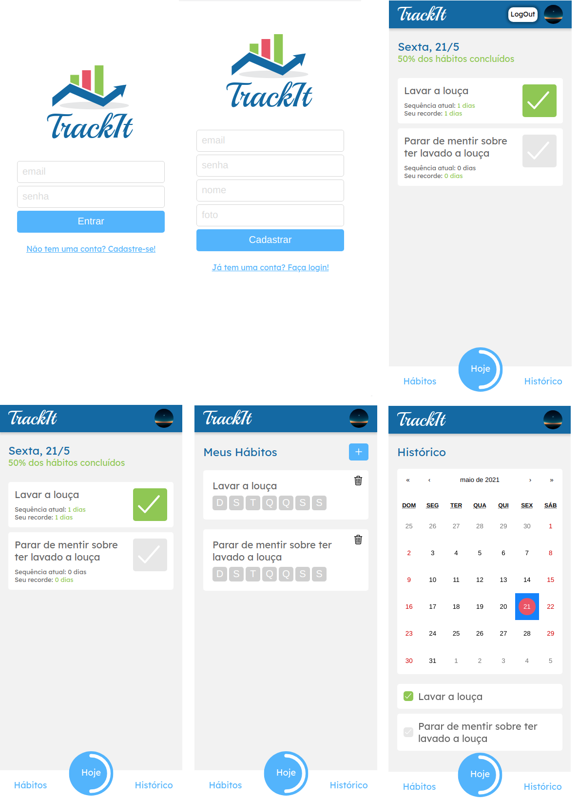

# TrackIt

TrackIt is a single-page application for tracking your habits and how often you stick to them. The data comes from the API provided by Responde Ai. The user can sign up, log in, create habits, delete habits, mark a habit as complete for the day and get a visual feel for how well they've been doing by looking at their habits calendar. 

## Built With

- React , JavaScript , CSS3 , HTML5  
- Windows, Linux

## Live Demo

[Live Demo Link](https://track-it-xi.vercel.app/)

## Instalation

- git clone https://github.com/vitorelourenco/track-it.git
- npm i

## Preview

run the command:
- npm start

## Deploy

You can deploy this project on vercel.com by pushing it to github and linking Vercel to it

## Authors

👤 **Vitor Emanuel Lourenco**

- GitHub: [@vitorelourenco](https://github.com/vitorelourenco)
- Twitter: [@Vitorel](https://twitter.com/Vitorel)
- LinkedIn: [vitoremanuellourenco](https://www.linkedin.com/in/vitoremanuellourenco/)

## 🤝 Contributing

Contributions, issues, and feature requests are welcome!

Feel free to check the [issues page](https://github.com/vitorelourenco/track-it/issues).

## Show your support

Give a ⭐️ if you like this project!

## Acknowledgments

- RespondeAi (https://www.respondeai.com.br/)
